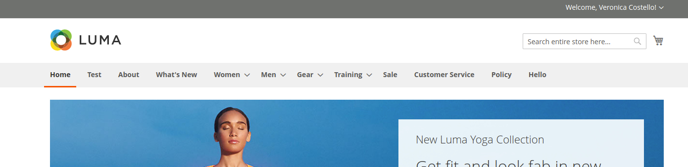

Full disclosure: This was a project that I cloned from another developer and modified to fit our own projects. It's not really meant for anyone else to use and may not be stable or updated in the future. Just so you know 😉


## Features:
- Add CMS Pages and custom menu links either before or after product category menu items
- Manage sort order of menu links



## How to install Extension

### Download
Zip:
1. Download the extension .zip file from github https://github.com/workwithizzi/magento2-custom-menu.
2. Copy the extension to the `{magento2-root-dir}/app/code/Izzi/CustomMenu`

Git:
From Magento Root,
```bash
mkdir -p app/code/Izzi && cd app/code/Izzi && git clone git@github.com:workwithizzi/magento2-custom-menu.git CustomMenu
```

### Add to Magento
Run the following series of command from SSH console of your server to install the extension:

#a)  Enable: `php bin/magento module:enable Izzi_CustomMenu  --clear-static-content`
#b)  Setup: `php bin/magento setup:upgrade`.
#c)  Compile: [setup di compile](https://devdocs.magento.com/guides/v2.3/config-guide/cli/config-cli-subcommands-compiler.html) `php bin/magento setup:di:comple`.
#d)  Deploy: [static content deploy](https://devdocs.magento.com/guides/v2.3/config-guide/cli/config-cli-subcommands-static-view.html) `bin/magento setup:static-content:deploy`


## How to Add Menu Links
From the Magento Admin, go to `Stores -> Configuration -> Custom Menu Links`


## Uninstall Extension
#a)  Uninstall: `php bin/magento module:uninstall -r Izzi_CustomMenu  --clear-static-content`
#b)  Flush Cache: `php bin/magento cache:flush`
#c)  Remove Files: From Magento root: `rm -rf app/code/Izzi/CustomMenu`
#d)  Compile: [setup di compile](https://devdocs.magento.com/guides/v2.3/config-guide/cli/config-cli-subcommands-compiler.html) `php bin/magento setup:di:comple`.
#e)  Deploy: [static content deploy](https://devdocs.magento.com/guides/v2.3/config-guide/cli/config-cli-subcommands-static-view.html) `bin/magento setup:static-content:deploy`